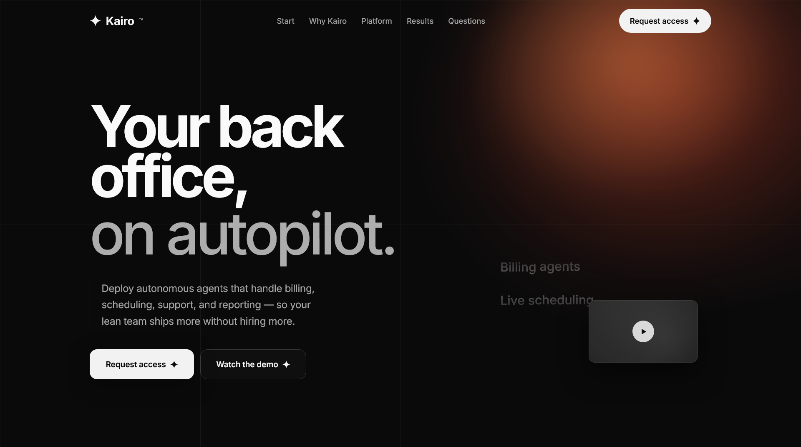

# Kairo Portfolio Landing Page

This project is a modern, responsive HTML portfolio-style landing page for **Kairo**, an AI operations platform concept. It is designed as a polished single-page website with strong visual storytelling, animated sections, and a premium SaaS presentation style.

**Built by Jagdish Prasad.**

## Project Overview

The website presents Kairo as a platform that helps teams automate billing, scheduling, support, reporting, and other back-office workflows using autonomous agents.

The page is structured as a complete landing experience with:

- A fixed navigation bar
- A bold hero section
- A "Why Kairo" introduction
- Animated stats
- Platform and capabilities sections
- Enterprise trust and security messaging
- Results and case-study style content
- Testimonials
- Insights / field notes cards
- FAQ accordion
- Waitlist / request access form
- Footer navigation and contact details

## Features

- Fully responsive layout for desktop, tablet, and mobile
- Custom dark and light section styling
- Scroll-based navbar effects
- Mobile navigation toggle
- Accordion interactions for FAQ and platform sections
- Animated stat counters
- Reveal-on-scroll animations
- Word-by-word text reveal effects
- Smooth anchor navigation
- Waitlist form interaction with inline success message
- Decorative SVG icons and visual motion effects

## Tech Stack

This project is built with a lightweight front-end stack:

- **HTML5** for page structure and semantic layout
- **CSS3** for styling, layout, animations, responsiveness, and design tokens
- **Vanilla JavaScript** for interactivity and UI behavior
- **Google Fonts**
  - `Inter`
  - `JetBrains Mono`
- **Inline SVG** for icons and decorative graphics
- **Intersection Observer API** for reveal animations and stat triggers
- **Responsive CSS Media Queries** for multi-device support

## Project Files

- `index.html`  
  Main structure of the landing page and all content sections.

- `styles.css`  
  Full visual system including colors, spacing, layout, section styles, animation rules, and responsive behavior.

- `script.js`  
  Handles navbar scroll behavior, mobile menu, accordions, counters, reveal animations, waitlist form feedback, and smooth scrolling.

- `img.png`  
  Project screenshot used for preview/documentation.

## Page Sections

The landing page includes the following major sections:

1. **Navbar**  
   Fixed header with logo, navigation links, CTA button, and mobile menu toggle.

2. **Hero Section**  
   Large headline, supporting copy, CTA buttons, animated feature ticker, and visual thumbnail card.

3. **About / Why Kairo**  
   Explains the product vision and includes a simulated agent activity panel.

4. **Stats Section**  
   Highlights production agents, teams onboarded, actions taken, and efficiency improvements.

5. **Platform Section**  
   Describes rollout, self-running workflows, support agents, and tool sync via accordion UI.

6. **Capabilities Section**  
   Covers visual agent studio, specialist agents, shared control, and audit features.

7. **Enterprise Section**  
   Presents compliance, governance, encryption, and enterprise readiness messaging.

8. **Results / Case Studies**  
   Showcases business outcomes through sticky case-study cards.

9. **Testimonials**  
   Displays customer quotes and profile cards.

10. **Field Notes / Insights**  
    A grid of article-style cards for thought leadership content.

11. **FAQ Section**  
    Expandable answers to common product questions.

12. **Waitlist CTA**  
    Email capture form for request access.

13. **Footer**  
    Final navigation, policy links, and contact references.

## Design Highlights

- Premium SaaS-inspired visual direction
- Alternating dark and light sections for contrast
- Large typography and bold spacing
- Grid overlays and glow effects
- Marquee text strips
- Motion-enhanced storytelling
- Strong mobile responsiveness

## External Resources Used

- **Google Fonts** for typography
- **Picsum Photos** placeholders for demo images

## How to Run Locally

Because this is a static front-end project, you can run it very easily:

1. Clone or download the project
2. Open `index.html` in a browser

You can also use a local live server in VS Code or any static server for development.

## GitHub Description

Suggested GitHub repository description:

`Responsive Kairo landing page built with HTML, CSS, and JavaScript by Jagdish Prasad.`

## GitHub Topics

Suggested GitHub topics:

- `html`
- `css`
- `javascript`
- `landing-page`
- `portfolio`
- `responsive-design`
- `frontend`
- `vanilla-javascript`
- `ui-design`
- `single-page-website`

## Author

**Jagdish Prasad**  
Frontend project creator and designer of this landing page.

## License

This project can be used as a personal portfolio, showcase project, or front-end design reference unless you want to attach a separate custom license.
